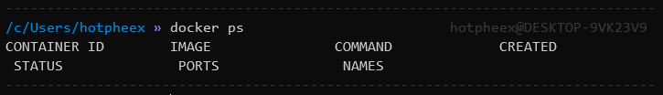
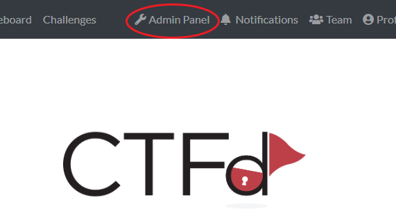

# Local CTF Instance
If you get stuck along the way, feel free to reach out for us on [Discord](https://discord.gg/KsSh24V) for a hand!

Please note that the `By a Thread` challenges will not be solvable, as we are no longer monitoring the email Inbox.

## Install Docker
* [Install Docker for your appropriate Operating System](https://docs.docker.com/get-docker/)

## Start CTFd Container
* Test that Docker is installed and correctly running


* Start a fresh CTFd container:
```
docker run -d -p 8000:8000 ctfd/ctfd:mark-2.3.3
```

* Browse to `http://localhost:8000` 

## Setup and Import
* Fill in the CTFd setup details with random information (It'll all get overwritten once you import the backup)

* Once you've passed the basic setup screen, click the `Admin Panel` buttom.


* Click `Config > Backup > Import > Choose File`


* Download the [CYBAR OSINT CTF EXPORT](CYBAR%20OSINT%20CTF%20EXPORT.zip)

* Upload the Export zip file and hit `Import`

* If it successfully imports you should land back on the CTFd Login page

* Login with `admin` as Username and Password